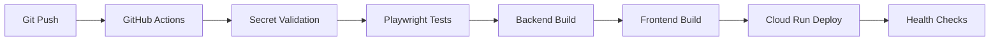

# 🧭 Clean Departure - Cleaning Service Marketplace

**A modern, AI-powered platform connecting clients with verified cleaning professionals**

[]()
[]()
[]()

## 🚀 Live Application

- **Frontend**: https://cleanpro-frontend-5539254765.europe-west1.run.app
- **Backend API**: https://cleanpro-backend-5539254765.europe-west1.run.app
- **Demo Admin**: admin@cleandeparture.com / admin123

## ✨ Key Features

### 🎯 Core Platform
- **User Authentication**: JWT-based auth with role-based access control
- **Dynamic Pricing**: Real-time pricing with distance calculation and discounts
- **Google Maps Integration**: Address autocomplete and coordination point validation
- **Payment Processing**: Secure Stripe integration with escrow system
- **Admin Dashboard**: Comprehensive business management interface

### 🤖 Advanced AI Systems
- **AI Communication Monitoring**: OpenAI GPT-4o-mini for tone analysis and red flag detection
- **Smart Matching Algorithm**: 5-factor weighted scoring for optimal CP-client matching
- **Email Notification System**: Multi-provider infrastructure with beautiful templates
- **Analytics Dashboard**: Real-time platform metrics and health monitoring

### 🛡️ Security & Trust
- **Identity Verification**: Manual admin-controlled CP verification workflow
- **Secure Payments**: Stripe integration with dynamic escrow hold periods
- **Privacy Protection**: Contact details hidden until payment confirmation
- **AI Moderation**: Automated content monitoring with escalation protocols

## 🏗️ Technical Architecture

### Backend (Node.js/Express)
```
📁 backend/
├── 🔧 index.js                    # Main server entry point
├── 🔥 firebase.js                 # Firebase lazy initialization
├── 📊 services/                   # Business logic services
│   └── analytics_service.js       # Platform metrics aggregation
├── 🛣️ routes/                     # Domain-organized API routes
│   ├── auth/index.mjs             # Authentication endpoints
│   ├── payments/index.mjs         # Payment processing
│   ├── analytics/index.mjs        # Analytics & monitoring
│   └── index.mjs                  # Centralized router
├── 🔒 middleware/                 # Shared middleware
│   └── validation.js              # Zod schema validation
└── 📝 schemas/                    # Type-safe schemas
    └── auth.js                    # Authentication schemas
```

### Frontend (React/Vite)
```
📁 frontend/
├── 🎨 src/
│   ├── App.jsx                    # Main application component
│   ├── components/                # Reusable UI components
│   │   ├── BookingForm.jsx        # Dynamic booking interface
│   │   ├── AdminDashboard.jsx     # Business management
│   │   ├── CPPortal.jsx           # Coordination point portal
│   │   └── PaymentModal.jsx       # Stripe payment integration
│   └── contexts/                  # React contexts
│       └── AuthContext.jsx        # Authentication state
└── 📦 package.json               # Dependencies & scripts
```

### 🔄 Deployment Pipeline


## 🚀 Getting Started

### Prerequisites
- Node.js 18+ and npm
- Google Cloud Platform account
- Firebase project with Firestore
- Stripe account for payments

### Local Development

1. **Clone and install dependencies:**
```bash
git clone https://github.com/Tazaai/cleanpro-site.git
cd cleanpro-site
npm install

# Backend
cd backend && npm install

# Frontend
cd ../frontend && npm install
```

2. **Configure local secrets:**
```bash
# Automated setup
./setup_local_secrets.sh

# Manual configuration
cp .env.example .env.local
# Edit .env.local with your development credentials
```

3. **Start development servers:**
```bash
# Backend (Terminal 1)
cd backend && npm run dev

# Frontend (Terminal 2)  
cd frontend && npm run dev
```

4. **Run tests:**
```bash
# Local backend testing
./test_backend_local.sh

# Comprehensive system validation
./copilot_mandatory_review.sh
```

## 🔐 Environment Configuration

### Local Development (`.env.local`)
```bash
# Core Infrastructure
GOOGLE_MAPS_API_KEY=your_maps_key
JWT_SECRET=your_jwt_secret

# Firebase (Development)
FIREBASE_KEY=your_dev_firebase_key

# Stripe (Test Mode)
STRIPE_SECRET_KEY=sk_test_...
STRIPE_WEBHOOK_SECRET=whsec_test_...

# AI Services (Optional)
OPENAI_API_KEY=sk-...
```

### Production (GitHub Secrets)
All production credentials are managed via GitHub repository secrets:
- `GCP_PROJECT`, `GCP_SA_KEY` (Google Cloud deployment)
- `FIREBASE_KEY` (Production Firebase service account)
- `GOOGLE_MAPS_API_KEY`, `OPENAI_API_KEY` (External APIs)
- `STRIPE_SECRET_KEY`, `STRIPE_WEBHOOK_SECRET` (Payment processing)

## 🧪 Testing Strategy

### Automated Testing
```bash
# Backend API testing
./test_backend_local.sh              # Local endpoint validation
./test_coordination_api.sh           # Production API health
./test_analytics_api.sh              # Analytics endpoints

# AI System testing  
./test_ai_monitoring.sh              # Communication monitoring
./test_smart_matching.sh             # Matching algorithm
./test_email_system.sh               # Email notifications

# End-to-end testing
npm run test:playwright              # Browser automation
```

### Manual Testing
- **Health Endpoints**: `GET /health`, `GET /debug/firebase`
- **Auth Flow**: Registration → Login → Protected routes
- **Booking Flow**: Address → Service → Pricing → Payment
- **Admin Functions**: User management → Analytics → CP approval

## 📊 API Documentation

### Authentication (`/api/auth`)
```javascript
POST /api/auth/register              // User registration with Zod validation
POST /api/auth/login                 // JWT token authentication
GET  /api/auth/profile               // User profile retrieval
PUT  /api/auth/profile               // Profile updates
POST /api/auth/change-password       // Secure password changes
```

### Bookings (`/api/bookings`)
```javascript
GET  /api/bookings/preview           // Dynamic pricing calculation
POST /api/bookings                   // Create new booking
GET  /api/bookings/:id               // Booking details
PUT  /api/bookings/:id               // Update booking status
```

### Analytics (`/api/analytics`)
```javascript
GET  /api/analytics/summary          // Platform overview metrics
GET  /api/analytics/service/:name    // Service-specific analytics
GET  /api/analytics/health           // System health monitoring
GET  /api/analytics/logs/recent      // Recent activity logs
```

### AI Monitoring (`/api/ai-monitoring`)
```javascript
POST /api/ai-monitoring/analyze      // Communication tone analysis
GET  /api/ai-monitoring/test         // System diagnostics
POST /api/ai-monitoring/emergency-alert // Critical incident handling
```

## 🔧 Development Workflow

### Code Quality Standards
- **Route Organization**: Domain-based structure (`/routes/auth/`, `/routes/payments/`)
- **Type Safety**: Zod schema validation for all API endpoints
- **Error Handling**: Consistent error responses with proper HTTP codes
- **Security**: JWT authentication, input validation, Firebase security rules

### Deployment Process
1. **Pre-Deployment**: Local testing via `./test_backend_local.sh`
2. **CI/CD Pipeline**: GitHub Actions with secret validation
3. **Post-Deployment**: Mandatory review via `./copilot_mandatory_review.sh`
4. **Health Monitoring**: Automated endpoint validation and system diagnostics

### Git Workflow
```bash
# Feature development
git checkout -b feature/new-feature
# Make changes, commit with descriptive messages
git commit -m "feat: add new feature with validation"

# Testing and validation
./test_backend_local.sh
./copilot_mandatory_review.sh

# Deploy via main branch
git checkout main
git merge feature/new-feature
git push origin main                 # Triggers automatic deployment
```

## 📈 System Monitoring

### Health Endpoints
- **Backend Health**: `GET /health` - System status and Firebase connectivity
- **Firebase Debug**: `GET /debug/firebase` - Database connection diagnostics
- **Maps Debug**: `GET /debug/maps` - Google Maps API status

### Analytics Dashboard
Access real-time platform metrics via the CP Portal:
- System health monitoring with service status indicators
- AI monitoring logs with tone analysis and red flag detection
- Email delivery tracking and success rates
- Smart matching algorithm performance metrics

### Error Monitoring
- **Validation Errors**: Zod schema validation with detailed error messages
- **Authentication Failures**: JWT token validation and role-based access
- **Payment Issues**: Stripe webhook monitoring and transaction tracking
- **Firebase Connectivity**: Lazy initialization with graceful degradation

## 🛣️ Development Roadmap

### Phase 1: ✅ Technical Architecture (Complete)
- Route modularization by domain
- Zod validation implementation
- Shared middleware patterns
- Reduced technical debt

### Phase 2: 🚧 Mobile-First UI (In Progress)
- Responsive CP Portal redesign
- Mobile-optimized navigation
- Touch-friendly interactions
- Progressive disclosure patterns

### Phase 3: 📊 Business Intelligence
- Investor-ready analytics (CAC, LTV, retention)
- A/B testing framework
- Competitive analysis tracking
- Revenue forecasting models

### Phase 4: 🎨 UX Simplification
- Streamlined booking flow
- Quick-quote functionality
- One-click repeat bookings
- Enhanced copywriting and brand messaging

## 🤝 Contributing

1. **Review PROJECT_GUIDE.md** for comprehensive system context
2. **Run mandatory validation** before any changes
3. **Follow domain-based architecture** for new features
4. **Use Zod schemas** for all new API endpoints
5. **Test locally first** before deployment

### Development Guidelines
- **No bypasses allowed**: All changes must pass validation
- **Documentation first**: Update README/PROJECT_GUIDE for architecture changes
- **Security focused**: All user inputs validated, all endpoints authenticated
- **Mobile ready**: Design with responsive, touch-friendly interfaces

## 📄 License

This project is proprietary software. All rights reserved.

## 🆘 Support

- **Technical Issues**: Review logs via `./review_report.sh`
- **Deployment Problems**: Check GitHub Actions workflow status
- **Firebase Connectivity**: Run `./firebase_detailed_diagnosis.sh`
- **Local Development**: Use `./setup_local_secrets.sh` for configuration

---

**Clean Departure** - *Your trusted platform for verified, transparent cleaning services powered by smart automation.*